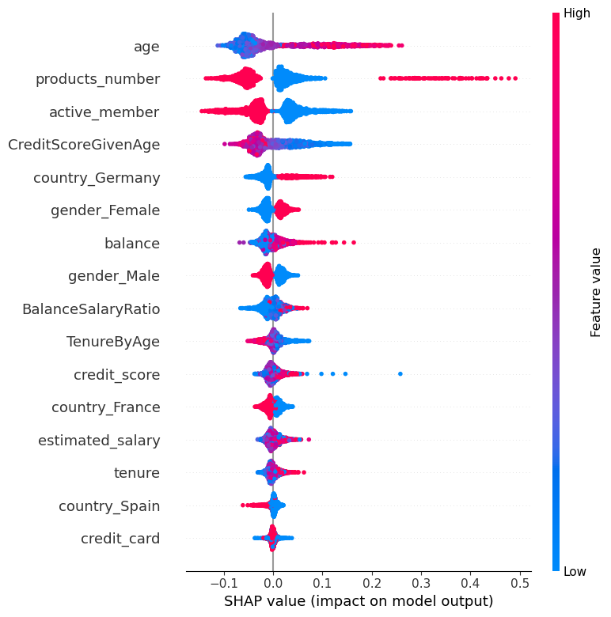

# Bank-customer-churn-prediction - BankingBros
We aim to accomplish the follwowing through our study: 
* Identify and visualize the most important features contributing to Bank customer churn using ExpalinableAI(XAI)
* Build a best performing prediction Machine Learning Model that will:
    * Classify if a customer will churn or not
    * Preferable select the best performing model based on the probability to best identify the customer who will churn
    * Explain the important features through SHAP(SHapely Additive exPlanations) Values
    * Deploy the MLmodel using Streamlit for active usage by the consumers.
    
  
